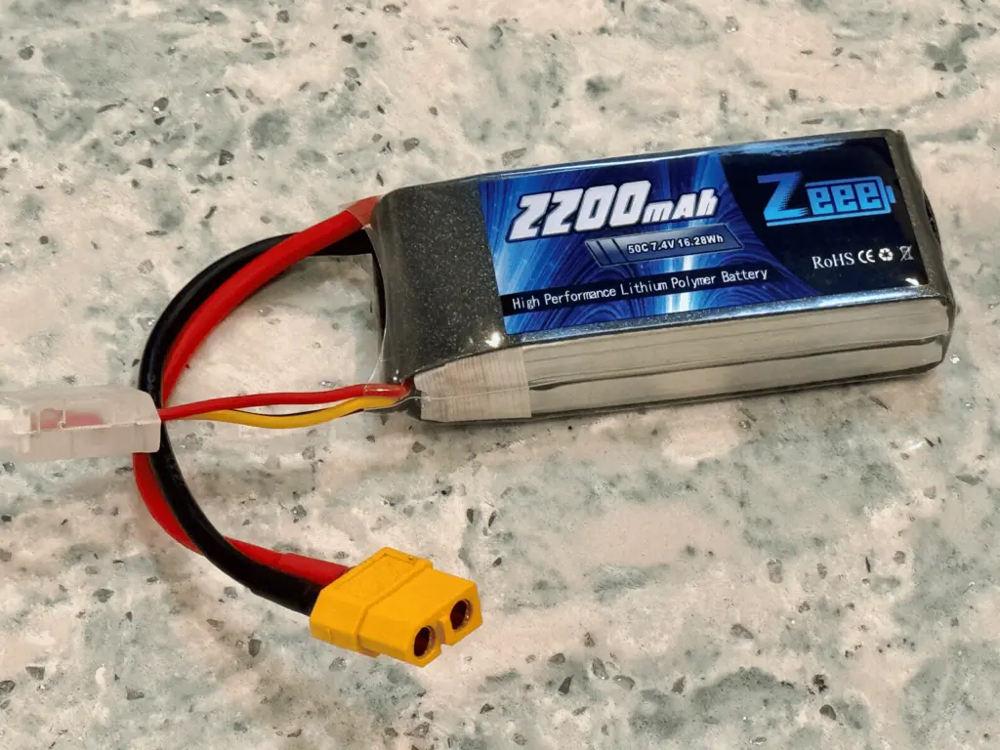
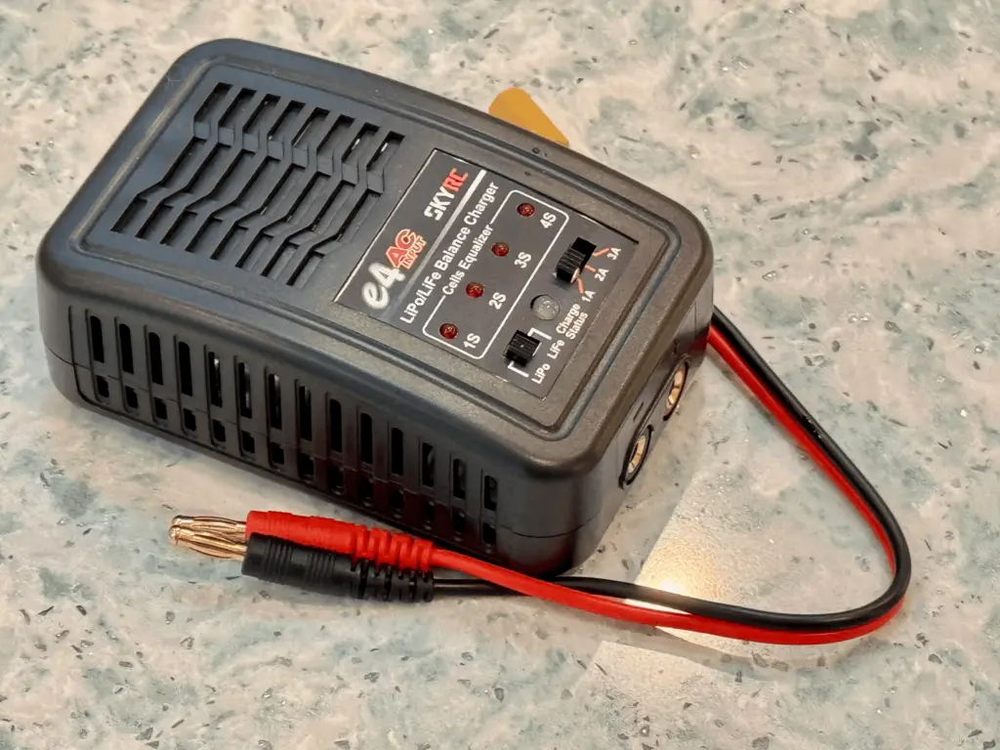

# Batteries

The **battery** is the power source for your RC vehicle, supplying energy to the motor, ESC, servos, and any accessories. Choosing the right battery is crucial for balancing performance, runtime, and longevity. Let’s explore the basics and help you make the best choice for your RC truck.

## Understanding Battery Types

1. **LiPo (Lithium Polymer)**:
       - The most common type for RC vehicles.
       - Known for high power output, lightweight design, and excellent energy density.
       - Requires careful handling and storage to prevent damage.
2. **NiMH (Nickel-Metal Hydride)**:
       - An older technology, less common in modern RC setups.
       - Heavier and less efficient than LiPo but more forgiving for beginners.

For off-road trucks like yours, **LiPo batteries** are the clear choice due to their superior power and performance.

## Key Specifications

1. **Voltage (S Rating)**:
       - Measured in **cells (S)**. Each LiPo cell provides 3.7V nominal voltage.
       - Common configurations:
             - **2S (7.4V)**: Moderate speed and torque. Beginner-friendly and easier on electronics.
             - **3S (11.1V)**: Higher speed and torque. Best for advanced users or those seeking maximum performance.
       - Your ESC and motor must support the voltage you choose.
2. **Capacity (mAh)**:
       - Indicates how much energy the battery can store, measured in milliampere-hours (mAh).
       - A higher capacity means longer runtime but adds weight. For 1/10 off-road trucks, aim for **3000-5000mAh**. (Note: I chose a smaller 2200mAh battery due to it's smaller _physical_ size that fit in my build better.)
3. **C-Rating**:
       - Measures how quickly the battery can safely discharge its energy.
       - Formula: **Max Current (A) = Capacity (Ah) × C-Rating**.
       - Example: A 5000mAh battery with a 50C rating can provide **250A** of current.
       - For off-road trucks, look for a **25C-50C** rating to ensure consistent power delivery.
4. **Connector**:
       - Our selected ESC uses an **XT60 connector**, so make sure your battery has the same or use an adapter.

## Charging and Safety Tips

1. **Charger**:
    - Use a balance charger like the selected **e4 SkyRC** to ensure each c    ell charges evenly.
2. **Charging Rates**:
       - Follow the **1C rule**: Charge at a rate equal to the battery capacity. For a 5000mAh battery, charge at **5A**.
       - Our selected charger’s max rate is 3A, so expect slightly longer charge times.
3. **Storage**:
       - Store LiPo batteries at **3.8V per cell** to extend their lifespan.
       - Use a LiPo-safe bag for added safety.

## Good, Better, Best Recommendations

### **Good**: **Zeee 2S 3000mAh 25C LiPo**

- Affordable and reliable for beginners.
- Great for casual off-road driving with decent runtime.

### **Better**: **Gens Ace 2S 5000mAh 50C LiPo**

- Offers longer runtime and higher power output.
- Perfect for balanced performance in off-road conditions.

### **Best**: **Ovonic 3S 5000mAh 50C LiPo**

- High voltage for maximum speed and power.
- Ideal for experienced drivers looking for peak performance.

> Sidebar: My battery mistake and how to avoid it. I originally bought two 5000 mAh 2S batteries, thinking that bigger capacity is better; I'd get longer run times. What I didn't account for was the physical size of the battery and how it would, or in this case, would not, fit in my vehicle build. The 5000 mAh battery was too large and never would have fit in the RC truck I chose to build. I returned them and bought a pair of 2S 2200 mAh batteries instead. Interesting fact: The 2200 mAh batteries were almost the same price as the 5000 mAh batteries.

## Final Thoughts

Your battery choice can make or break your RC experience. A **2S LiPo** is a great starting point for its manageable speed and power, while a **3S LiPo** adds extra punch for those ready to take things up a notch. Pair your battery with a quality charger, follow safety precautions, and you’ll be ready for hours of off-road fun. Next, let’s dive into [servos](./servos.md).
