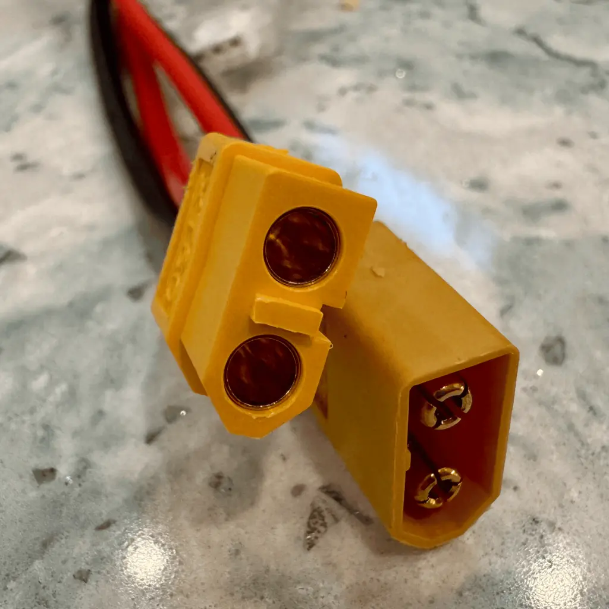
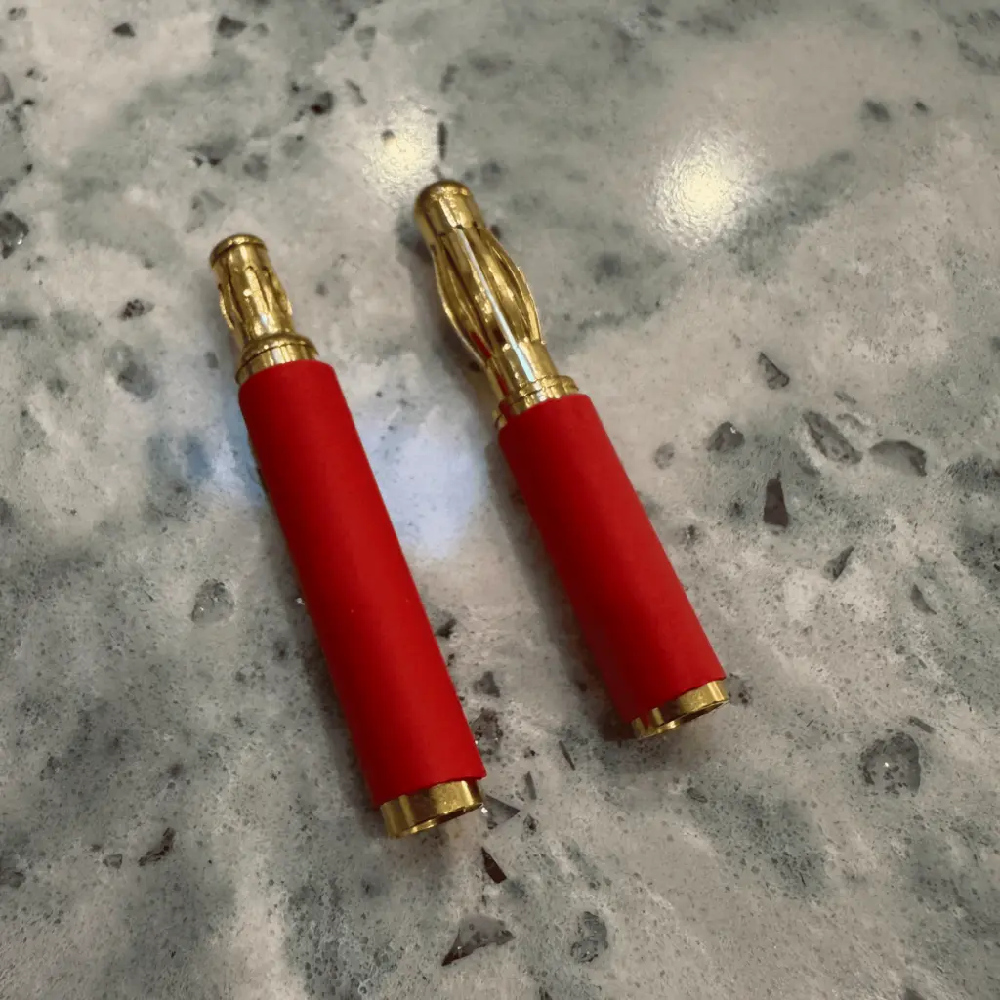

# Connectors

Connectors may be small, but they play a critical role in keeping your RC vehicle running smoothly. They ensure power flows reliably between the battery, ESC, and motor while also providing safe, secure connections that withstand the demands of off-road driving. Let’s break down the most common connector types, their uses, and what to look for when choosing them.

## Understanding Connector Types

### Battery to ESC Connectors

These connectors handle the high current flow between your battery and ESC. Compatibility is key here since mismatched connectors can cause frustrating compatibility issues or require adapters.

- **XT60**:
    - **Current Rating**: Up to 60A.
    - **Why It’s Popular**: Reliable, compact, and beginner-friendly. Perfect for most 1/10 scale trucks running 2S or 3S LiPos.
    - **Use Case**: A **HOBBYWING EZRUN MAX10 G2** ESC already uses an XT60 connector, so pairing it with an XT60-equipped battery ensures easy plug-and-play compatibility.

- **Deans (T-Plug)**:
    - **Current Rating**: Up to 60A.
    - **Why It’s Popular**: A classic connector, widely used but slightly less robust than XT60.
    - **Use Case**: Often found in older setups or budget batteries.

- **EC3/EC5**:
    - **Current Rating**: EC3 (~60A), EC5 (~120A).
    - **Why It’s Popular**: Designed by Horizon Hobby and common with Spektrum products.
    - **Use Case**: Higher current systems, especially if you’re using Spektrum batteries and ESCs.

- **Traxxas Connector**:
    - **Current Rating**: Varies by model, often up to 100A.
    - **Why It’s Popular**: Proprietary connector used by Traxxas vehicles.
    - **Use Case**: If you’re using Traxxas products, these connectors are standard.

### ESC to Motor Connectors

For brushless motors, these connectors transmit power between the ESC and motor:

- **Bullet Connectors**:
    - Standard sizes: **3.5mm** and **4mm**.
    - **Why It’s Popular**: Secure and easy to connect/disconnect.
    - **Use Case**: Pre-soldered bullet connectors are often included on motors and ESCs. Make sure both sides match.

### Accessory Connectors

These connectors power accessories like lights or fans:

- **JST (Red)**:
    - Low-current connector, commonly used for powering small components.
    - Compact and lightweight.
- **XT30**:
    - A smaller version of the XT60, designed for higher-current accessories.

## Choosing the Right Connectors

To avoid the hassle of soldering or using adapters, choose components that use the same connector type. Since our selected ESC and charger both use **XT60**, look for batteries with XT60 connectors to keep things simple.

## Good, Better, Best Recommendations

### Good: Amass XT60 Connectors

- **Why Choose This**:
    - Affordable and reliable XT60 connectors for DIY repairs or upgrades.
    - Pre-soldered options available to simplify installation.

### Better: Gens Ace 2S or 3S Batteries with XT60 Connectors

- **Why Choose This**:
    - Trusted brand with excellent performance.
    - XT60 connectors ensure direct compatibility with your ESC and charger.

### Best: Castle Creations 4mm Bullet Connectors (ESC to Motor)

- **Why Choose This**:
    - High-quality connectors designed for high-performance brushless setups.
    - Perfect for upgrades or repairs to your ESC-motor connection.

## Final Thoughts

Connectors might not be flashy, but they’re essential for a reliable RC setup. Stick to a standard like **XT60** to keep your system simple and compatible. Whether you're upgrading or building from scratch, having the right connectors ensures smooth operation and fewer headaches. Next up: [Wrapping it all together](./putting-it-together.md).

## Appendix: Bullet connectors details

> Sidebar: Avoid my mistake with bullet connectors. I didn't properly spec the bullet connector sizes between my motor and my ESC choices. The ESC can handle up to 120A so it uses 4mm bullet connectors. My motor requires less current so it came with 3.5mm bullet connectors. I had to buy a pack of 3.5mm-to-4mm converters to get my ESC to connect properly to my motor.

Bullet connectors are the standard choice for connecting an ESC to a brushless motor, allowing efficient power transfer while ensuring easy installation and removal. Here’s a summary of the common sizes, their trade-offs, and compatibility considerations:

### Common Bullet Connector Sizes

1. **3.5mm Bullet Connectors**
    - **Pros**:
        - Compact and lightweight.
        - Commonly used in 1/10 scale RC vehicles.
        - Easy to find and widely supported.
    - **Cons**:
        - Limited current-carrying capacity compared to larger sizes.
        - Best suited for moderate power setups (e.g., 2S-3S LiPos with 60A ESCs).
    - **Compatibility**:
        - Ideal for motors and ESCs designed for 1/10 scale trucks.

2. **4mm Bullet Connectors**
    - **Pros**:
         - Handles higher currents (e.g., 80A+ setups).
         - Robust connection with reduced resistance.
         - Suitable for both 1/10 and some larger scale vehicles.
    - **Cons**:
         - Slightly heavier and bulkier than 3.5mm connectors.
    - **Compatibility**:
         - A common choice for motors and ESCs in higher-performance 1/10 scale builds or light-duty 1/8 scale vehicles.

3. **5.5mm Bullet Connectors**
    - **Pros**:
        - High current capacity for powerful setups (e.g., 100A+ ESCs).
        - Durable and ideal for heavy-duty applications like 1/8 scale trucks or larger.
    - **Cons**:
        - Larger size and weight may not be necessary for smaller vehicles.
        - Less common in standard 1/10 scale setups.
    - **Compatibility**:
        - Typically used in high-power systems or larger scale RC vehicles.

### Trade-Offs

- **Size vs. Current Handling**:
    - Smaller connectors (e.g., 3.5mm) are lighter and better suited for lower-current applications.
    - Larger connectors (e.g., 4mm, 5.5mm) offer more durability and current-carrying capacity but add weight and bulk.
- **Ease of Use**:
    - All bullet connectors allow easy connection and disconnection, but larger sizes may be slightly more challenging to solder and fit into compact spaces.
- **Resistance**:
    - Larger connectors generally have lower electrical resistance, which improves efficiency in high-power setups.

### Compatibility Considerations

- Match the connector size between your motor and ESC to avoid the need for adapters.
- Verify the current rating of the connectors aligns with your system’s power demands (e.g., battery voltage, ESC current rating).
- Consider future upgrades; opting for 4mm connectors may give flexibility for higher-power setups down the road.

### Recommendation

For our first 1/10 off-road truck:

- Stick with **3.5mm bullet connectors** if your setup is moderate power (e.g., 2S or 3S LiPo with a 60A ESC).
- Consider **4mm bullet connectors** if you’re running a more powerful setup (e.g., 3S LiPo with an 80A ESC like your Hobbywing MAX10 G2).
