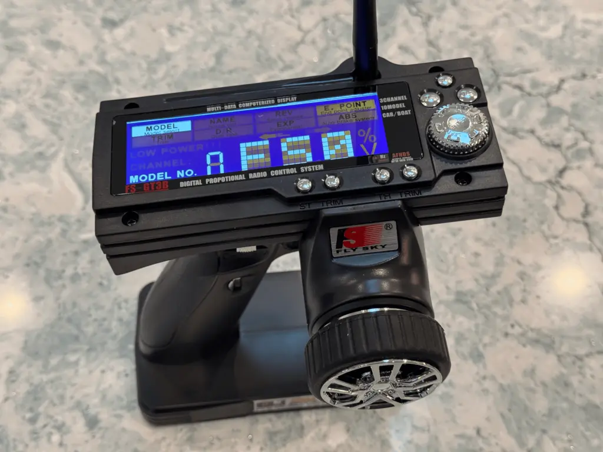
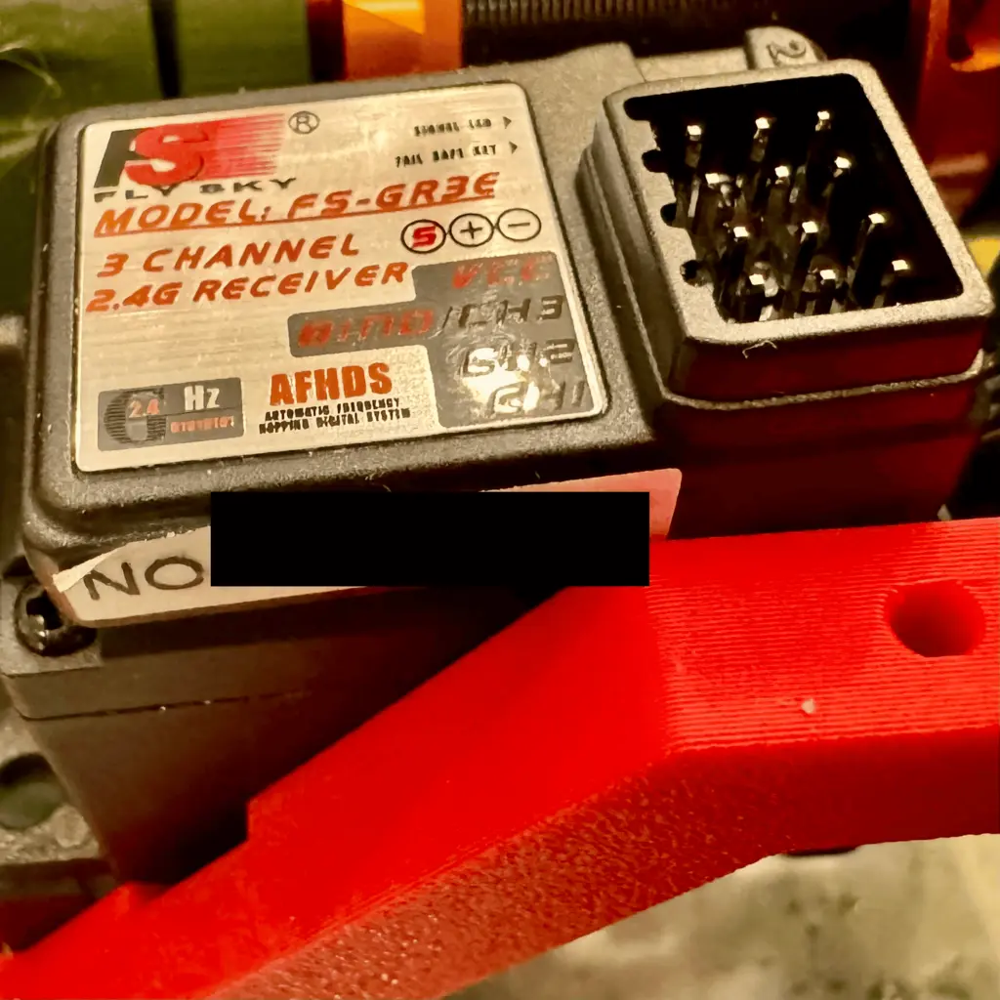

# Controllers (Transmitters and Receivers)

The **controller** is your direct connection to your RC vehicle. It’s how you steer, accelerate, brake, and manage any extra features like lights or winches. Controllers typically consist of two parts: the **transmitter** (what you hold in your hand) and the **receiver** (installed in the vehicle). Together, they ensure your commands are sent and executed seamlessly. Let’s break it down.

## How Controllers Work

1. **Transmitter (TX)**:
     - This is the handheld device with joysticks, wheels, or triggers that you use to control the vehicle.
     - It sends signals to the receiver over a **2.4GHz frequency**, which is standard for modern RC systems because it reduces interference and improves range.

2. **Receiver (RX)**:
    - Installed in your vehicle, the receiver interprets the signals from the transmitter and passes them to the appropriate components (e.g., ESC, servo, lights).
    - It typically connects to the ESC, steering servo, and any additional channels for accessories.

## Key Specifications

When selecting a controller, consider the following:

1. **Number of Channels**:
    - Each **channel** controls one function. For a basic truck, you need at least:
       - **Channel 1**: Steering.
       - **Channel 2**: Throttle/brake.
    - Additional channels (3-6) are useful for controlling features like lights, gear shifts, or winches.
2. **Range**:
    - Most 2.4GHz transmitters have a range of about 300-500m, more than enough for off-road or backyard driving.
3. **Telemetry (Optional)**:
    - Higher-end systems can send real-time data (e.g., battery voltage, motor temperature) back to the transmitter.
4. **Ergonomics**:
    - Comfort matters, especially for long sessions. Look for a well-balanced transmitter with easy-to-reach controls.
5. **Model Memory**:
    - If you plan to own multiple RC vehicles, look for a transmitter with **model memory** to store settings for each vehicle.

## Types of Transmitters

1. **Pistol-Grip**: Common for surface RC vehicles. Features a trigger for throttle/brake and a wheel for steering.
2. **Stick-Style**: Used more often in planes, boats, or legacy vehicles but still functional for cars.

> What I bought: I got a pistol-grip transmitter for my build. It has three channels. It's the FlySky model FS-GT3B identified below as the "Good" recommendation.

## Good, Better, Best Recommendations

### **Good**: **FlySky FS-GT3B**

- **Channels**: 3.
- **Why Choose This**:
       - Affordable and beginner-friendly.
       - Reliable 2.4GHz signal and basic settings.
       - Great for getting started with no-frills control.

### **Better**: **FlySky FS-GT5**

- **Channels**: 6.
- **Why Choose This**:
       - Offers room to grow with additional channels.
       - Features model memory and telemetry support.
       - A great balance of performance and price.

### **Best**: **Spektrum DX5 Rugged**

- **Channels**: 5.
- **Why Choose This**:
       - Built for durability, with a waterproof and rugged housing.
       - Advanced customization and telemetry capabilities.
       - Perfect for experienced users who want top-tier control.

## Final Thoughts

Choosing the right controller depends on your goals and budget. A basic controller like the FlySky FS-GT3B is perfect for beginners, while the FS-GT5 and Spektrum DX5 Rugged cater to hobbyists looking for advanced features and durability. No matter which you choose, a good controller ensures that every turn, jump, and throttle burst feels smooth and responsive. Next, let’s power things up with [batteries](./batteries.md).
