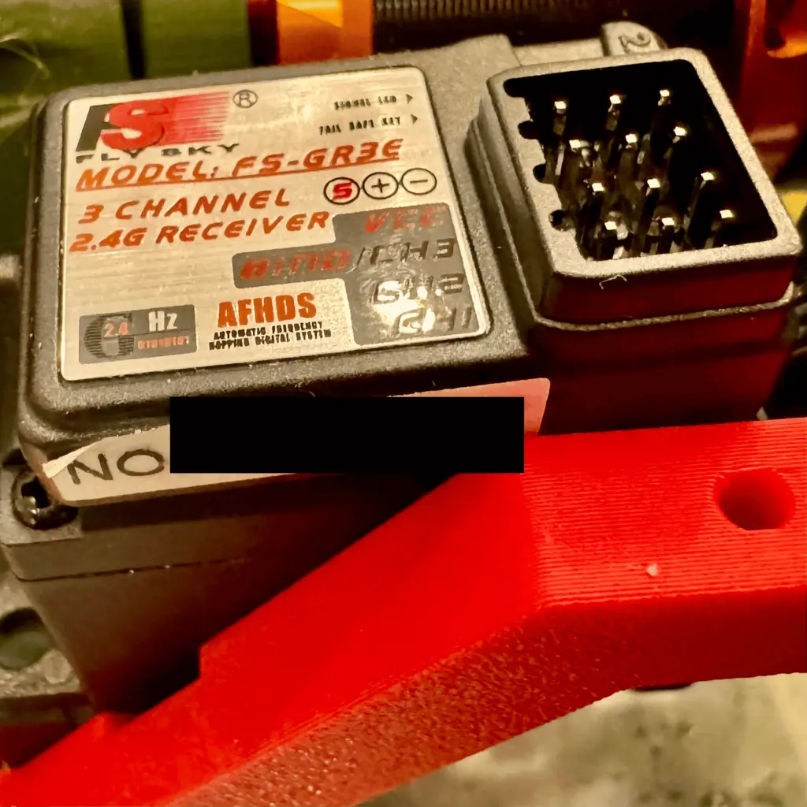

# Vehicle Components

> As mentioned on the [About](../about.md) page, I'm focused on land / wheeled vehicles for now as I build my first one from scratch.

Welcome to the world of RC vehicles! In this chapter, we’ll explore the core components that bring your RC vehicle to life. Whether you’re a beginner or a seasoned hobbyist, understanding how each part works and how they fit together is key to building, maintaining, and upgrading your RC machine. Here’s an overview of what we’ll cover:

## Motors

Motors are the heart of your vehicle, converting electrical energy into motion. We’ll break down the differences between high-torque and high-speed options, explain KV ratings and turns (T), and help you choose the right motor for your driving style.

## ESCs (Electronic Speed Controllers)

The ESC is your vehicle’s brain for power delivery, managing how much energy flows from the battery to the motor. From drag brake settings to reverse functionality, we’ll guide you through picking an ESC that fits your needs.

## Controllers (Transmitters and Receivers)

Your controller is how you command your vehicle. We’ll cover the basics of channels, range, and features, helping you select a transmitter and receiver that match your ambitions and budget.

## Batteries

Batteries fuel the entire system, so choosing the right one is critical. We’ll explain 2S vs. 3S LiPos, how mAh affects runtime, and what C-Ratings mean for performance. You’ll also get tips on charging safely.

## Servos

Servos handle precise movement, like steering. Learn about torque, speed, and why metal gears and waterproofing can make a big difference for off-road adventures.

## Tires and Wheels

Tires and wheels aren’t just about aesthetics; they impact traction, handling, and compatibility. We’ll explore how to match tire sizes, choose the right treads, and ensure everything fits perfectly.

## Connectors

Connectors tie everything together. From XT60s to bullet connectors, we’ll demystify these tiny but crucial components to ensure your setup is as smooth as possible.

Each section will give you the knowledge to make informed decisions, whether you’re building from scratch, upgrading, or troubleshooting. Let’s get started!
