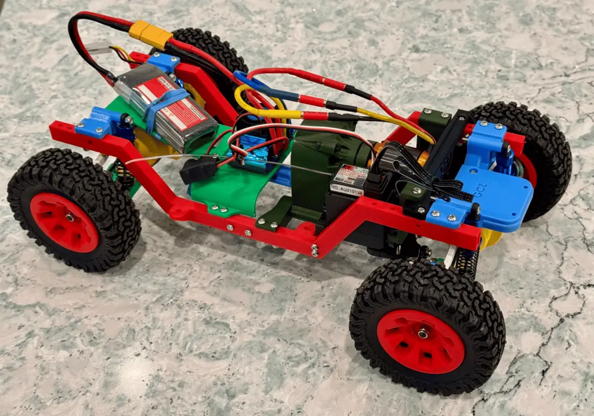

# Putting It All Together

Now that we’ve explored the essential components of your RC vehicle, it’s time to connect the dots and build a cohesive system. Whether you’re assembling your first RC truck or upgrading a specific part, this guide will help ensure everything works together smoothly.

## Step 1: Plan Your Build

Before diving into assembly, it’s important to have a clear plan:

1. **Define Your Goals**:
    - Are you building for speed, off-road capability, or a balance of both?
    - Knowing this will guide your choices for components like motors and tires.
2. **Check Compatibility**:
    - Ensure your battery, ESC, motor, and connectors are compatible in terms of voltage, current, and physical fit.
3. **Gather Tools**:
    - Essential tools include hex drivers, a soldering iron (if needed), a LiPo-safe bag, and a small toolkit.

## Step 2: Assemble the Electronics

### Connect the ESC

- Mount the **ESC** securely in your chassis, ideally in a location with good airflow to prevent overheating.
- Plug the ESC into the **receiver’s throttle channel (Channel 2)**.
    - Note the orientation of the plug: Be sure positive and ground are connected correctly: typically the red wire is positive and the black one is ground.
- Connect the **ESC to the motor** using the bullet connectors. Match the wires (A, B, C) for sensorless setups or follow the manufacturer’s instructions for sensored systems.

> Sidebar: Motor direction. If you hook up your whole system and notice your motor is turning the opposite way to what you expected or wanted, just swap any of the two out of three wires and it will spin the other direction. This assumes you're using a three-wire brushless motor and compatible ESC.

### Install the Servo

- Mount the steering **servo** in the designated spot on your chassis.
- Connect the servo horn or linkage to the steering mechanism.
- Plug the servo into **Channel 1** on the receiver.
    - Note the orientation of the plug: Be sure positive and ground are connected correctly: typically the red wire is positive and the black one is ground.

### Add the Battery

- Ensure the battery fits snugly in the chassis and is secured with a strap or holder.
- Connect the battery to the ESC using the **XT60 connector** or the appropriate adapter.
- Double-check the voltage and charge level before powering up.

## Step 3: Attach Tires and Wheels

- Mount the **tires and wheels** onto the axles, ensuring the hex hubs align correctly.
- Tighten the wheel nuts securely, but avoid over-tightening to prevent damaging the threads.

## Step 4: Bind the Receiver and Transmitter

- Follow your transmitter’s instructions to bind it with the receiver.
    - Note that most kits that include both a transmitter and receiver together come pre-bound from the factory.
- Turn on your transmitter first, then your receiver (in the vehicle.) This ensures proper communication and prevents the vehicle from receiving stray signals that might cause damage.
- Test all channels to ensure proper communication:
    - Channel 1: Steering.
    - Channel 2: Throttle/brake.
- Adjust endpoints and trims as needed for precise control.

## Step 5: Perform a Safety Check

1. **Inspect All Connections**:
    - Ensure all wires are securely connected and insulated.
2. **Test Throttle and Steering**:
    - Lift the vehicle and test the throttle, brake, and steering functions before placing it on the ground.
3. **Check for Interference**:
    - Modern 2.4GHz systems rarely have interference, but it’s worth confirming in a controlled environment.

## Step 6: Hit the Road (or Trail)

Once everything checks out, your RC truck is ready to roll! Start slow to ensure everything functions as expected, then push the limits as you gain confidence.

## Final Thoughts

Building an RC truck from scratch is as rewarding as it is exciting. By understanding and carefully assembling each component, you’ll not only have a powerful machine but also the satisfaction of knowing every detail of your build. Take your time, experiment with upgrades, and most importantly, enjoy the ride!

Here's my Voyager_MK1 build so far using all the components and choices we've covered in this section.

