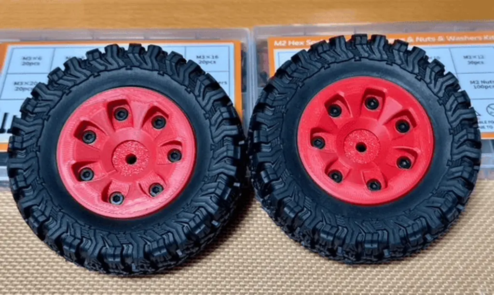

# Tires and Wheels

Tires and wheels are critical to your RC vehicle’s performance, affecting traction, handling, and overall durability. The right set can make the difference between conquering tough terrain and spinning in place. Let’s break down what you need to know to choose the perfect tires and wheels for your off-road truck.

## Understanding Tire Specifications

### Outer Diameter (OD)

- **Definition**: The total height of the tire when mounted on a wheel.
- **Impact**: Larger diameters improve ground clearance and are ideal for rough terrain. For our first build, an OD of **90mm** is a good fit.

### Inner Diameter (ID)

- **Definition**: The size of the opening where the tire fits onto the wheel.
- **Standard**: Measured in inches (e.g., **1.9 inches**). Ensures compatibility between tires and wheels.

### Width

- **Definition**: The overall width of the tire.
- **Impact**: Wider tires provide better stability and traction but may add weight. For off-road use, a width of **33mm** strikes a good balance.

### Tread Pattern

- **Knobby Tread**: Best for loose dirt, mud, and rocks.
- **Street Tread**: Ideal for smooth surfaces but less effective off-road.
- **Hybrid Tread**: Offers a balance of performance on various terrains.

## Understanding Wheels

### Hex Size

- **Definition**: The hexagonal hub in the center of the wheel that connects to the axle.
- **Standard**: For 1/10 scale vehicles, a **12mm hex** is most common.

### Material

- **Plastic Wheels**: Lightweight and cost-effective but less durable.
- **Aluminum Wheels**: Heavier and more durable, better for rugged terrain.
- **3D-printed plastic Wheels**: This is what I chose for my build as it was specified in the printing and build guides for my first 1/10 scale off-road truck. The advantage with these is that they are three separate parts that bolt together to form a bead-lock on the tire, eliminating the need for any glue.

### Beadlock vs. Glued Wheels

- **Beadlock Wheels**: Use a ring to clamp the tire to the wheel. Easy to swap tires without glue.
- **Glued Wheels**: Tires are glued onto the wheel, lighter but harder to replace.

## Matching Tires and Wheels

Ensure your tires and wheels share the same inner diameter (e.g., **1.9-inch tires with 1.9-inch wheels**) and hex size (e.g., **12mm hex**). This compatibility guarantees proper fitment and performance.

## Good, Better, Best Recommendations

### Good: Injora 1.9-Inch Tires and Wheels Set

- Affordable and includes both tires and wheels.
- Knobby tread for solid off-road performance.
- Pre-glued, making them beginner-friendly.

### Better: Pro-Line Trencher 1.9 Tires with Plastic Beadlock Wheels

- Durable tread design for all-terrain use.
- Beadlock wheels make swapping tires easier.
- Great balance of performance and value.

### Best: Pit Bull Rock Beast 1.9 Tires with Aluminum Beadlock Wheels

- Premium off-road performance with outstanding traction.
- Rugged aluminum wheels for extreme durability.
- Perfect for advanced users tackling the toughest terrain.

## Final Thoughts

The right tires and wheels can unlock your RC truck’s full potential. For beginners, a pre-glued set like the Injora is an easy way to start. As you grow more experienced, consider upgrading to beadlock wheels and premium tires like the Pit Bull Rock Beasts for maximum performance and versatility. 3D-printed wheels let you choose your colour, material (different types of plastic like PLA, PETG, or ABS) and you can easily re-print one if it breaks. Next up: [Connectors](./connectors.md).
