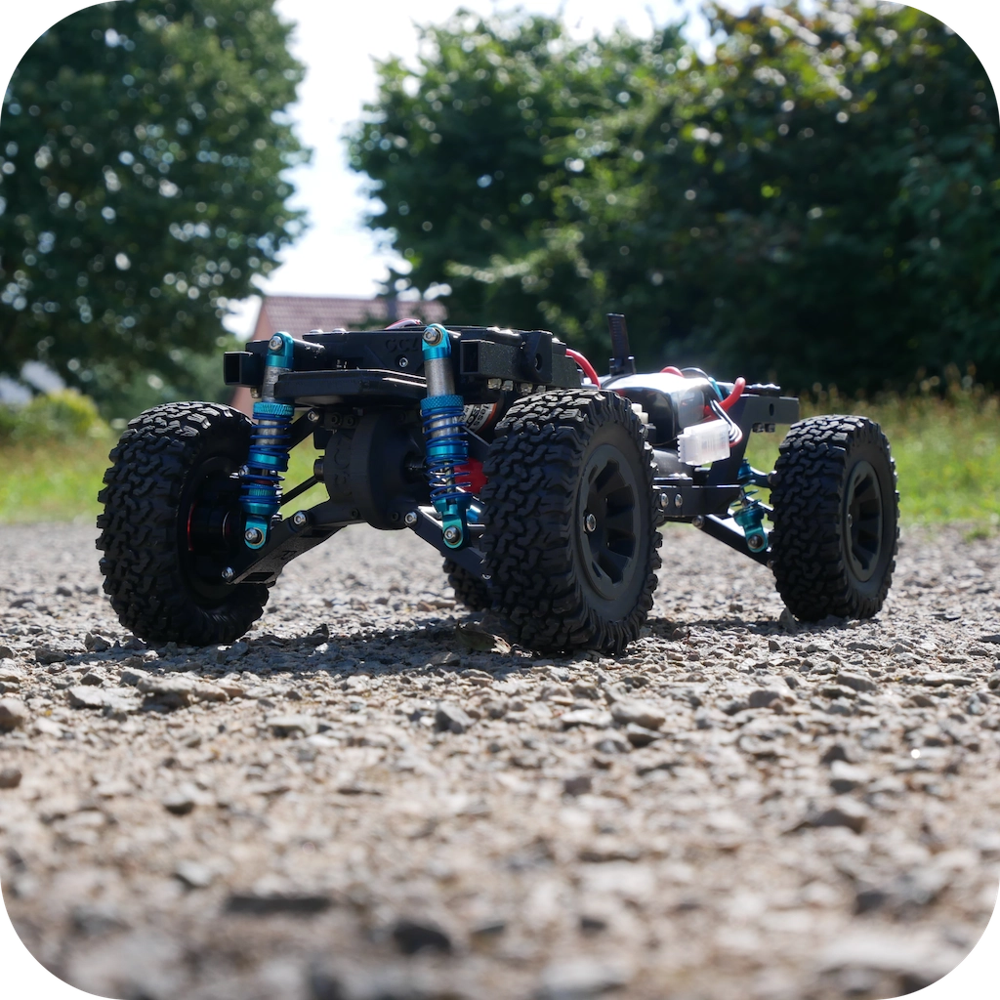
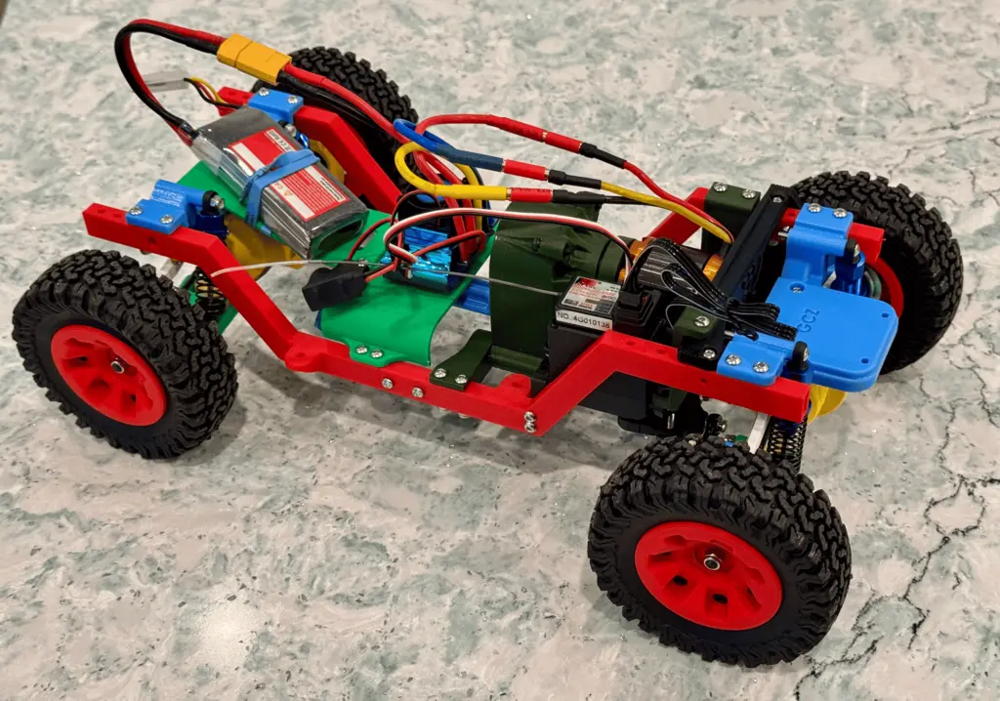

# Voyager_MK1

I found the print files for the [Voyager_MK1](https://gcz-creation.com/voyager_mk1-2/) 4x4 3D printed truck chassis online and decided I wanted to build it. It's a 1/10 scale 4-wheel-drive chassis that looks quite functional and fun to use. The print files and build guide made by [GCZ Creation](https://gcz-creation.com/) and are free and available online. Thank you to GCZ Creation for inspiring me to start this RC Vehicle journey.

> *Note:* The above image is from the creator's site, not my build.

GCZ Creation sells a 3D printed truck body called [*Recon*](./recon.md) that matches the Voyager_MK1 chassis. I'm also building that as part of my project.

There are three guides written to help prepare materials, print the parts, and build the Recon body.

| Guide | Description |
|-------|-------------|
| [Bill of Materials (BOM)](https://docs.google.com/presentation/d/11Y_GmD9s0-Ci28eno_yFh6EEDxndLT5MRmE85NNxkUk/edit#slide=id.g28f9ad9ed56_1_0) | What to buy |
| [Printing](https://docs.google.com/presentation/d/1lvwPIc1goK-NP6fZSq7aW_BkPhivgA5mtONZM_Pz8Oo/edit#slide=id.g2dedf7ee755_0_103) | Instructions on how to print the parts using a 3D printer. |
| [Build](https://docs.google.com/presentation/d/1zMWEAc3pfqOwVZxiSLQSs3KfB4sd-50Kix4_I4QGEFg/edit#slide=id.g2dedf7ee755_0_103) | Detailed guide on assembling the printed parts into the final truck chassis. |

| Where to get the files |
| --- |
| [Thingiverse](https://www.thingiverse.com/thing:6760406/files) |
| [Printables](https://www.printables.com/model/1001592-voyager-mk1-3d-printed-110-offroad-rc-chassis) |
| [Cults](https://cults3d.com/fr/mod%C3%A8le-3d/jeu/voyager-mk1-3d-printed-1-10-offroad-rc-chassis) |

## My advice

- Don't leave reading the BOM Guide until later. To get the least expensive parts you might have to wait a while for them to arrive. Order early so you have the parts when you have finished printing the components. Also, check the Recon BOM Guide for additional parts to include those in your order.
- Order the filament for the chassis early too. You can intersperse printing chassis and body parts as you work your way through the process.
- Join the [Facebook](https://www.facebook.com/groups/987064876515079) group (ugh, I know!) for GCZ Creation. The creator is on there and they are very responsive to questions and feedback.

## My build so far

Here's my Voyager_MK1 build so far, the technicolour beast.

